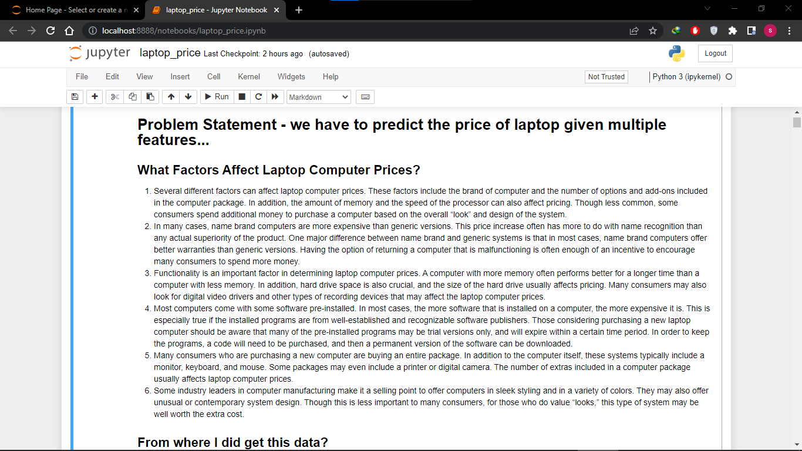

[Project webapp  link:](https://laptop-final.herokuapp.com)

I have made this project from end to end using DVC data version control.


All code has been written while following OOPs concept.

It Predicts the price of the laptop according to the selected Specifications.

We can check the each models accuracy with the help of DVC and also check how 
our models perform as the parameters changes.

It can also shows how much the difference between the old and new parameters.

Youtube Links - 
1. [](https://youtu.be/89lz9NRXD6E)

2. [](https://youtu.be/52VVn1SHlx0)

3. [](https://youtu.be/OLiO46V484Y)





activate the environment

conda create -n laptop_env python=3.7 -y


conda activate laptop_env

create a requirement file requirement.txt
install the dependencies with help of it


create a req file , mention requirements
and install the dependecies


pip -r install -r requirements.txt


git init

dvc init

dvc add data_given/laptop_data.csv

git add . 

git commit -m "data added dvc tracking"

git add . && git commit -m "update README.md"

#create given_data folder and place the dataset inside it


#crete a git repo of project 


```
bash
git remote add origin https://github.com/shuklasid19/Laptop_Price_Prediction.git
git branch -M main
git push origin main
```

params conains the parameters of the project
dvc is used for running stages one by one in sequential manner


we create get_data.py to get data
and load_data.py for loading and preprocessing it

after that we 

dvc repro


shows the metrics
dvc metrics show

to check difference from old and new model 

dvc params diff


tox

for rebuilding

tox -r


its used for running the test file to check all test are satisfied or not
pytest command

pytest -v


for installing local commands
setup commands -
pip intall - e .


it creates packages and contains infor

build your own package command-
python setup.py sdist bdist wheel

create a artifacts folder


build you own package commands-
python setup.py sdist bdist wheel


to add commit and push at once
git add . && git -m "updating readme" && git push origin main 


linting a style writing method , kidn of standard style by pype method
flake 8 library is used to track the changes , and goodness of code.
